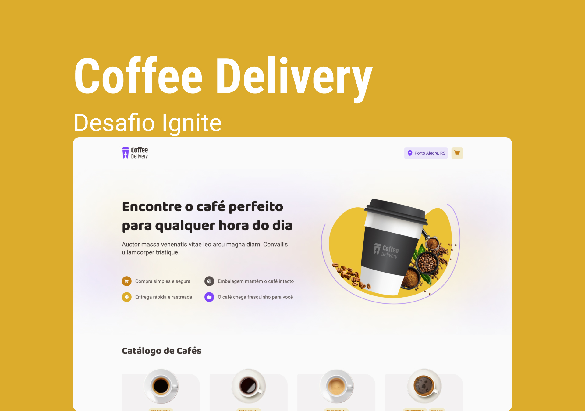

<h1 align="center"> Habits </h1>

NLW é um evento exclusivo e gratuito, promovido pela Rocketseat para ensino de tecnologias WEB.  

  <a href="#-tecnologias">Tecnologias</a>&nbsp;&nbsp;&nbsp;|&nbsp;&nbsp;&nbsp;
  <a href="#-projeto">Projeto</a>&nbsp;&nbsp;&nbsp;|&nbsp;&nbsp;&nbsp;
  <a href="#-layout">Layout</a>&nbsp;&nbsp;&nbsp;|&nbsp;&nbsp;&nbsp;
  <a href="#memo-licença">Licença</a>

  

 

  

## 🚀 Tecnologias

Esse projeto foi desenvolvido com as seguintes tecnologias:

- ReactJS
- React Router
- Styled Components
- Git e Github
- Figma

## 💻 Projeto

O Coffee Delivery é um projeto de desafio do ignite da Rocketseat.

- [Visite o projeto online](https://ignite-02-desafio-coffee-delivery.vercel.app/)

## 🔖 Layout

Você pode visualizar o layout do projeto através [DESSE LINK](https://www.figma.com/file/m40EDEttof1CaexIXLTaJo/Coffee-Delivery-(Copy)?node-id=0%3A1&t=OojWQyFROLjKxInY-0). É necessário ter conta no [Figma](https://figma.com) para acessá-lo.

## :memo: Licença

Esse projeto está sob a licença MIT.

---
